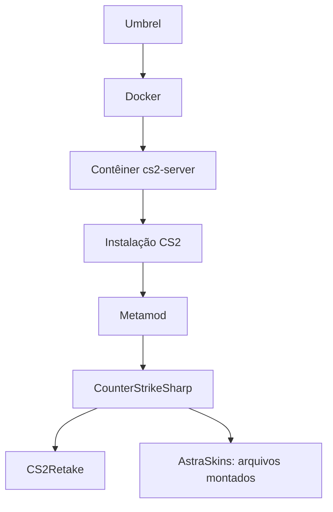

# Arquitetura observada

A imagem Docker observada é `joedwards32/cs2:latest`. O contêiner tem política de reinício `unless-stopped`.

O Docker informou montagens do tipo `bind` para `/home/steam/cs2-dedicated` e para diretórios/arquivos de Metamod, CounterStrikeSharp, CS2Retake e AstraSkins sob a instalação. Isso confirma os destinos **dentro** do contêiner; não confirma o caminho correspondente no host nem em qual SSD cada origem está.

A verificação de saúde externa é feita com Uptime Kuma. A configuração exata do monitor e os detalhes de rede não são publicados aqui.
